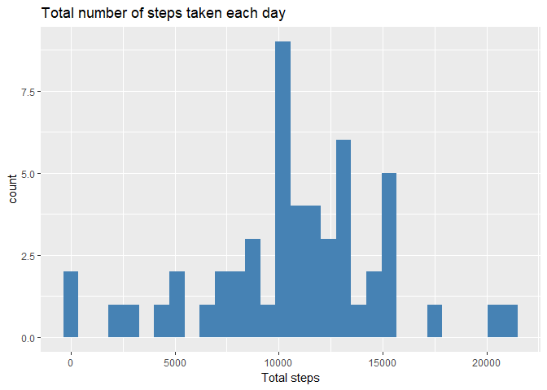
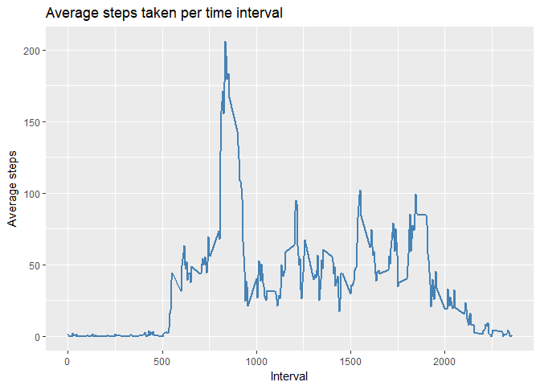
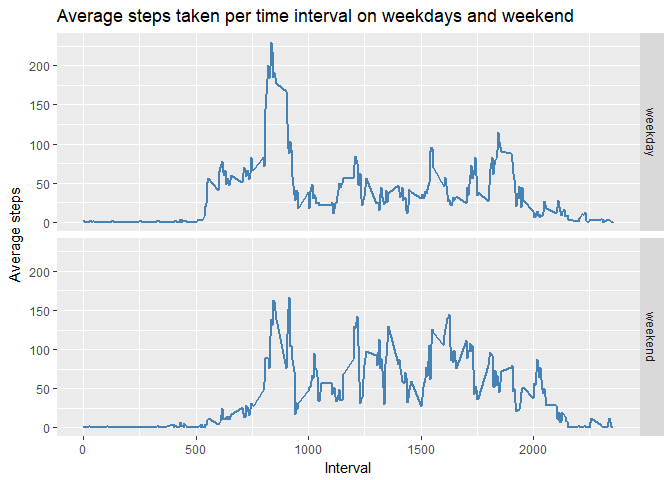

# Reproducible Research: Peer Assessment 1
Yanchenko Artem  
May 21, 2017  


## Loading and preprocessing the data

**Step 1. Load packages**  


```r
library(tidyverse)
```

**Step 2. Download the data set**  


```r
## fileUrl <- "https://d396qusza40orc.cloudfront.net/repdata%2Fdata%2Factivity.zip"
## download.file(fileUrl, destfile = "Factivity.zip")
```

**Step 3. Unpak the data set**  


```r
unzip("Factivity.zip")
```

**Step 4. Read the data set into R**  


```r
orgnl_dataset <- as.tbl(read.csv("activity.csv", header = TRUE))
```

## What is mean total number of steps taken per day?

**Step 1. Calculate total number of steps taken each day**  


```r
ttl_steps_day <- orgnl_dataset %>% select(date, steps) %>% filter(steps != "NA") %>%
    group_by(date) %>% summarise(tot_steps = sum(steps))
```

**Step 2. Plot a histogram of the total number of steps taken each day**  


```r
ggplot(ttl_steps_day, mapping = aes(x = tot_steps))+
    geom_histogram(stat = "bin", bins = 30, na.rm = TRUE, fill = "steelblue")+
    labs(x = "Total steps", title = "Total number of steps taken each day")
```

<!-- -->

**Step 3. Mean and median number of steps taken each day**  

Mean number of steps taken each day:  

```r
mean(ttl_steps_day$tot_steps)
```

```
## [1] 10766.19
```

Median number of steps taken each day:  

```r
median(ttl_steps_day$tot_steps)
```

```
## [1] 10765
```

## What is the average daily activity pattern?

To see the average daily activity pattern we need to average the number of steps taken within each of the 5 min intervals across all available days and plot it.


```r
av_int_act <- orgnl_dataset %>% select(interval, steps) %>%
    group_by(interval) %>% summarise(avg_steps = mean(steps, na.rm = TRUE))

ggplot(av_int_act, mapping = aes(x = interval, y = avg_steps))+
    geom_line(colour = "steelblue", size = 1)+
    labs(x = "Interval",y = "Average steps",
         title = "Average steps taken per time interval")
```

<!-- -->

**Which 5-minute interval, on average across all the days in the dataset, contains the maximum number of steps?**  

```r
max_int_name <- av_int_act$interval[which.max(av_int_act$avg_steps)]
max_int_val <- av_int_act$avg_steps[which.max(av_int_act$avg_steps)]
```

The name of the interval that contains the most steps on average across all the days in the dataset is 835 and it contains 206.1698113 steps.

## Imputing missing values

The original dataset has 2304 missing values in "steps" variable, represented by "NA".  

I think the best **strategy to impute the missing values** would be to substitute the missing data for the average of the particular time interval measured across all available days.  
This way we will not distort the picture too much.  
To do this we can use the average value of the steps taken within each time interval computed in previous question.  
As a result we will create new dataset called "no_na_dataset" free from NA's.


```r
no_na_dataset <- orgnl_dataset

for (i in 1:nrow(no_na_dataset)) {
    int_name <- no_na_dataset$interval[i]
        if (is.na(no_na_dataset$steps[i]) == TRUE) {
            int_mean <- av_int_act$avg_steps[av_int_act$interval == int_name]
            no_na_dataset$steps[i] <- as.integer(round(int_mean)) }
}
```

Let's check the result.  

```r
summary(no_na_dataset)
```

```
##      steps                date          interval     
##  Min.   :  0.00   2012-10-01:  288   Min.   :   0.0  
##  1st Qu.:  0.00   2012-10-02:  288   1st Qu.: 588.8  
##  Median :  0.00   2012-10-03:  288   Median :1177.5  
##  Mean   : 37.38   2012-10-04:  288   Mean   :1177.5  
##  3rd Qu.: 27.00   2012-10-05:  288   3rd Qu.:1766.2  
##  Max.   :806.00   2012-10-06:  288   Max.   :2355.0  
##                   (Other)   :15840
```

Now, let's recalculate total number of steps taken each day using data from the new dataset with imputed missing values and show it on a histogram.  


```r
ttl_steps_day2 <- no_na_dataset %>% select(date, steps) %>%
    group_by(date) %>% summarise(tot_steps = sum(steps))

ggplot(ttl_steps_day2, mapping = aes(x = tot_steps))+
    geom_histogram(stat = "bin", bins = 30, na.rm = TRUE, fill = "steelblue")+
    labs(x = "Total steps", title = "Total number of steps taken each day (imputed)")
```

-1.png)<!-- -->

As you can see, our histogram changed. It means that the way we inputed missing values has changed the data.  


Let's check if mean and median total steps taken each day have changed as well.  

```r
summary(ttl_steps_day2$tot_steps)
```

```
##    Min. 1st Qu.  Median    Mean 3rd Qu.    Max. 
##      41    9819   10760   10770   12810   21190
```

As you can see, mean and median total steps taken daily did not change.  
So we may conclude that data did not change dramaticaly.  

## Are there differences in activity patterns between weekdays and weekends?

To compare activity patterns of weekdays and weekend we will add new categorical variable to our dataset with no missing values. Let's call it "day". It will have 2 levels: "weekday" and "weekend".  
Days from Monday to Friday will be called "weekday", Saturday and Sunday - "weekend".  


```r
no_na_dataset$date <- as.Date(no_na_dataset$date)

no_na_dataset <- no_na_dataset %>%
    mutate(day = weekdays(no_na_dataset$date))

for (i in 1:nrow(no_na_dataset)){
    if (no_na_dataset$day[i] %in% c("Saturday", "Sunday")){
        no_na_dataset$day[i] <- "weekend"
    } else { no_na_dataset$day[i] <- "weekday" }
}

no_na_dataset$day <- as.factor(no_na_dataset$day)
```

To be able to see average activity patterns typical for each time interval on weekdays and weekend separately, we need to group our dataset by day type and take mean of steps across each time interval.  


```r
av_int_act_wd <- no_na_dataset %>% select(day, interval, steps) %>%
    group_by(day, interval) %>%
    summarise(avg_steps = mean(steps))
```

Now, let's make a panel plot with 2 time series plots.  
First - showing average number of steps taken within each 5 min interval on weekdays.  
Second - showing average number of steps taken within each 5 min interval on weekend.


```r
ggplot(av_int_act_wd, mapping = aes(x = interval, y = avg_steps))+
    geom_line(colour = "steelblue", size = 1)+
    facet_grid(day~.)+
    labs(x = "Interval", y = "Average steps",
         title = "Average steps taken per time interval on weekdays and weekend")
```

<!-- -->
